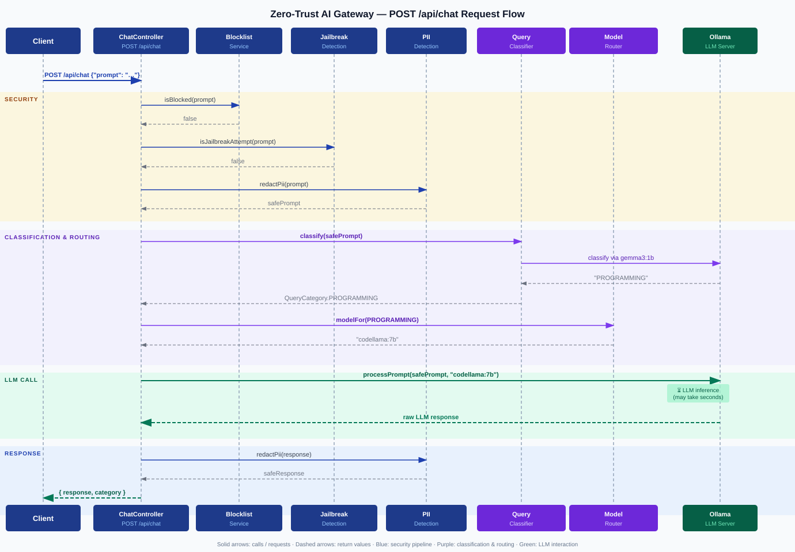

# Zero-Trust AI Gateway

## Overview

A Spring Boot / Spring Cloud Gateway application that sits in front of LLM services and enforces multiple security layers on every request and response. All traffic — regardless of source — is treated as untrusted and must pass through the full filter chain before reaching the model and before any response is returned to the caller.

## Architecture



```
Client
  │
  ▼
[OAuth2 / JWT Auth]           ← prod profile only (JWKS-validated)
  │
  ▼
[TokenGuardFilter]            ← per-user request/token rate limiting (Redis)
  │
  ▼
[JailbreakClassifierFilter]   ← prompt injection / jailbreak detection
  │
  ▼
[Spring Cloud Gateway Router]
  ├─ /api/llm/**       → lb://llm-service
  └─ /api/secure-llm/** → lb://secure-llm
  │
  ▼
[Downstream LLM / Ollama]
  │
  ▼
[PiiRedactorFilter]           ← PII redaction on the response
  │
  ▼
Client


POST /api/chat (direct endpoint)

Client
  │
  ▼
[Blocklist + Jailbreak check]
  │
  ▼
[PII redaction on prompt]
  │
  ▼
[QueryClassifierService]      ← small model classifies the query category
  │
  ▼
[ModelRoutingService]         ← maps category → specialist model
  │
  ▼
[Ollama — specialist model]
  │
  ▼
[PII redaction on response]
  │
  ▼
Client  { "response": "...", "category": "PROGRAMMING" }
```

A direct `/api/chat` endpoint is also available, which calls Ollama directly (bypassing the proxy routes) and applies the same jailbreak and PII logic inline. On this endpoint, every prompt is also classified by a small model before being forwarded, and routed to the specialist model configured for that category.

## Tech Stack

| Layer | Technology |
|---|---|
| Framework | Spring Boot 3.2.4 + Spring Cloud Gateway (WebFlux / Netty) |
| Security | Spring Security OAuth2 Resource Server + JWT (JWKS) |
| LLM | Ollama (native `/api/chat` endpoint) |
| Rate limiting | Redis Reactive (sliding-window, per-user) |
| Resilience | Resilience4j circuit breaker |
| Observability | Spring Boot Actuator + Micrometer + Prometheus |
| Containers | Docker (OpenJDK 17 slim) |

## Project Structure

```
ai-gateway/
├── src/main/java/com/securellm/
│   ├── GatewayApplication.java
│   ├── config/
│   │   ├── GatewayConfig.java          # routes + filter chain wiring
│   │   ├── SecurityConfig.java         # JWT / JWKS auth (prod profile)
│   │   ├── LocalSecurityConfig.java    # auth disabled (local profile)
│   │   └── RedisConfig.java            # ReactiveRedisTemplate bean
│   ├── controller/
│   │   ├── ChatController.java         # POST /api/chat (direct Ollama call)
│   │   └── ConnectivityController.java # GET  /api/v1/check-connectivity
│   ├── filter/
│   │   ├── TokenGuardFilter.java
│   │   ├── JailbreakClassifierFilter.java
│   │   └── PiiRedactorFilter.java
│   └── service/
│       ├── LlmService.java             # Ollama WebClient wrapper
│       ├── QueryClassifierService.java # classifies prompt into a category
│       ├── ModelRoutingService.java    # maps category → Ollama model name
│       ├── QueryCategory.java          # enum: PROGRAMMING, MATHEMATICS, …
│       ├── JailbreakDetectionService.java
│       ├── PiiDetectionService.java
│       └── TokenUsageService.java
└── src/main/resources/
    ├── application.yaml                # base config (all profiles)
    └── application-prod.yaml           # prod-only: JWT issuer / JWKS URI
```

## Security Layers

### 1. Authentication (prod only)
JWT Bearer tokens validated against your identity provider's JWKS endpoint. Actuator health/metrics paths are public. Disabled entirely in the `local` profile.

### 2. TokenGuardFilter
Enforces two independent Redis-backed sliding-window limits per user identity (resolved from JWT principal or `X-User-Id` header):
- **Requests per minute** — returns `429` with `Retry-After: 60`
- **Estimated tokens per hour** — returns `429` with `Retry-After: 3600`

Fails open (passes traffic) if Redis is unavailable.

### 3. JailbreakClassifierFilter
Buffers the request body and scans it against 14 regex patterns covering:
- Instruction-override phrases ("ignore all previous instructions", "forget your instructions")
- DAN / unrestricted-AI role-play
- Safety/restriction bypass attempts
- Raw model tokens injected into user input (`[INST]`, `<|im_start|>`, etc.)

Returns `403 Forbidden` on a match. Fails open on read errors.

### 4. PiiRedactorFilter
Intercepts the response body (text/JSON content types only) and redacts:

| Pattern | Placeholder |
|---|---|
| Email addresses | `[REDACTED-EMAIL]` |
| US Social Security Numbers | `[REDACTED-SSN]` |
| Credit / debit card numbers | `[REDACTED-CARD]` |
| US phone numbers | `[REDACTED-PHONE]` |
| IPv4 addresses | `[REDACTED-IP]` |
| US ZIP codes | `[REDACTED-ZIP]` |

## Query Classification & Model Routing

When a request arrives at `POST /api/chat`, a small classifier model analyses the prompt and assigns it to one of the categories below. The gateway then forwards the prompt to the specialist model configured for that category.

| Category | Default model | Example queries |
|---|---|---|
| `PROGRAMMING` | `codellama:7b` | "Write a binary search in Java", "Debug this Python script" |
| `MATHEMATICS` | `qwen2.5-math:7b` | "Solve x² + 2x − 3 = 0", "Prove that √2 is irrational" |
| `HISTORY` | `llama3.2:3b` | "Why did the Roman Empire fall?", "Who was Napoleon Bonaparte?" |
| `SCIENCE` | `llama3.2:3b` | "How does photosynthesis work?", "Explain quantum entanglement" |
| `CREATIVE_WRITING` | `mistral:7b` | "Write a short story about a lighthouse", "Give me a haiku about autumn" |
| `LEGAL` | `llama3.2:3b` | "What is the difference between civil and criminal law?" |
| `MEDICAL` | `llama3.2:3b` | "What are the symptoms of appendicitis?" |
| `GENERAL` | `gemma3:1b` | Anything that does not fit the above categories |

The classifier itself runs on `OLLAMA_CLASSIFIER_MODEL` (defaults to `gemma3:1b`), keeping classification fast and cheap. If the classifier fails or returns an unrecognised label, the gateway falls back to `GENERAL` and carries on — classification errors never block the request.

The response includes a `category` field so callers can see which model handled their query:

```json
{
  "response": "public int binarySearch(int[] arr, int target) { ... }",
  "category": "PROGRAMMING"
}
```

Every model can be overridden with an environment variable — see the Configuration section below.

## Endpoints

| Method | Path | Description |
|---|---|---|
| `POST` | `/api/chat` | Direct chat via Ollama — `{"prompt": "..."}` |
| `ANY` | `/api/llm/**` | Proxied to `lb://llm-service` (full filter chain) |
| `ANY` | `/api/secure-llm/**` | Proxied to `lb://secure-llm` (full filter chain) |
| `GET` | `/api/v1/check-connectivity` | Outbound connectivity health check |
| `GET` | `/actuator/health` | Application health |
| `GET` | `/actuator/prometheus` | Prometheus metrics |

## Configuration

### Environment variables

| Variable | Default | Description |
|---|---|---|
| `OLLAMA_BASE_URL` | `http://localhost:11434` | Ollama server URL |
| `OLLAMA_MODEL` | `gemma3:1b` | Fallback model name (must be pulled in Ollama) |
| `OLLAMA_CLASSIFIER_MODEL` | `gemma3:1b` | Model used to classify queries |
| `OLLAMA_MODEL_PROGRAMMING` | `codellama:7b` | Model for programming queries |
| `OLLAMA_MODEL_MATHEMATICS` | `qwen2.5-math:7b` | Model for mathematics queries |
| `OLLAMA_MODEL_HISTORY` | `llama3.2:3b` | Model for history queries |
| `OLLAMA_MODEL_SCIENCE` | `llama3.2:3b` | Model for science queries |
| `OLLAMA_MODEL_CREATIVE_WRITING` | `mistral:7b` | Model for creative writing queries |
| `OLLAMA_MODEL_LEGAL` | `llama3.2:3b` | Model for legal queries |
| `OLLAMA_MODEL_MEDICAL` | `llama3.2:3b` | Model for medical queries |
| `OLLAMA_MODEL_GENERAL` | `gemma3:1b` | Model for general / unclassified queries |
| `OLLAMA_TIMEOUT_SECONDS` | `120` | Request timeout |
| `REDIS_HOST` | `localhost` | Redis host |
| `REDIS_PORT` | `6379` | Redis port |
| `REDIS_PASSWORD` | _(empty)_ | Redis password |
| `MAX_REQUESTS_PER_MINUTE` | `60` | Per-user request rate limit |
| `MAX_TOKENS_PER_HOUR` | `100000` | Per-user token rate limit |
| `JAILBREAK_DETECTION_ENABLED` | `true` | Toggle jailbreak filter |
| `PII_REDACTION_ENABLED` | `true` | Toggle PII redaction filter |
| `JWT_ISSUER_URI` | _(required in prod)_ | OIDC issuer URI |
| `JWT_JWKS_URI` | _(required in prod)_ | JWKS endpoint URL |

### Profiles

| Profile | Auth | Use case |
|---|---|---|
| `local` (default) | Disabled — all requests permitted | Local development |
| `prod` | JWT required (JWKS-validated) | Production deployment |

## Prerequisites

**Docker (recommended)**
- Docker 24+ and Docker Compose v2

**Local (without Docker)**
- Java 17, Maven 3.x
- [Ollama](https://ollama.com) running locally with at least one model pulled
- Redis (required for rate limiting; gateway starts without it but rate limiting fails open)

## Build and Run

### Docker Compose (recommended)

The compose file starts the gateway, Redis, and an Ollama container together.

```bash
# 1. Start everything
docker compose up --build

# 2. Pull the models you want into the running Ollama container
docker compose exec ollama ollama pull gemma3:1b       # classifier + general
docker compose exec ollama ollama pull codellama:7b    # programming
docker compose exec ollama ollama pull llama3.2:3b     # history / science / legal / medical

# 3. The gateway is now available at http://localhost:8081
```

Override any model via env var without rebuilding:

```bash
OLLAMA_MODEL_PROGRAMMING=deepseek-coder:6.7b docker compose up
```

### Local (Maven)

```bash
# Pull a model into Ollama first
ollama pull gemma3:1b

# Build and run (local profile — auth disabled)
cd ai-gateway
mvn spring-boot:run

# Run in production mode
SPRING_PROFILES_ACTIVE=prod \
  JWT_ISSUER_URI=https://auth.example.com \
  JWT_JWKS_URI=https://auth.example.com/.well-known/jwks.json \
  mvn spring-boot:run
```

## Example request

```bash
curl -X POST http://localhost:8081/api/chat \
  -H "Content-Type: application/json" \
  -d '{"prompt": "Explain zero-trust security in one paragraph."}'
```

```json
{
  "response": "Zero-trust security is a model that assumes no user or system...",
  "category": "GENERAL"
}
```

```bash
curl -X POST http://localhost:8081/api/chat \
  -H "Content-Type: application/json" \
  -d '{"prompt": "Write a quicksort algorithm in Python."}'
```

```json
{
  "response": "def quicksort(arr): ...",
  "category": "PROGRAMMING"
}
```

## License

MIT License
